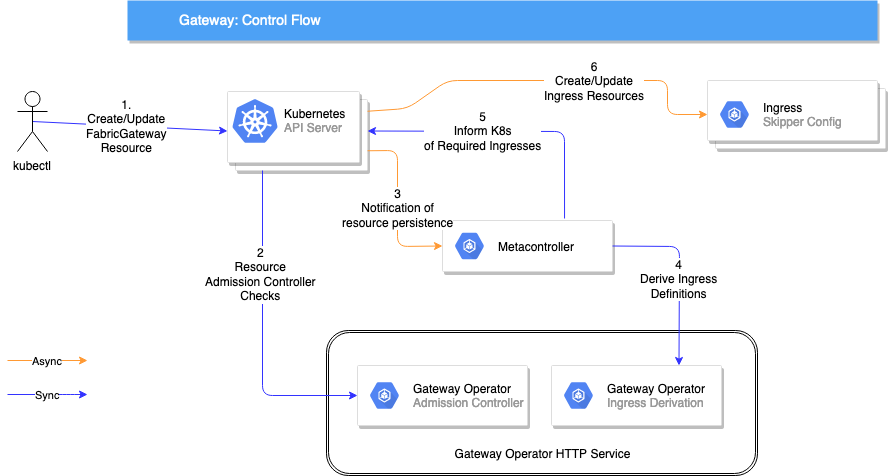

# Fabric API Gateway

Fabric API Gateway is an API Gateway built on [Skipper](https://github.com/zalando/skipper). Skipper is a HTTP router which has many features which are applied on a route-by-route basis, where each route is configured by a single Ingress. Fabric API Gateway generates these ingresses to support authentication, rate-limiting and more from a single [OpenAPI](https://swagger.io/specification/)-style [Custom Resource Definition](https://kubernetes.io/docs/tasks/access-kubernetes-api/custom-resources/custom-resource-definitions/).

## Features

The following features are supported:

* Authentication
* Authorization
* Service Whitelisting
* Rate Limiting
* Plaintext Request Rejection
* [Cross-Origin Resource Sharing](https://developer.mozilla.org/en-US/docs/Web/HTTP/CORS)

## Getting Started

See the [Getting Started](https://zalando-incubator.github.io/fabric-gateway) guide.

## Development

### Updating Documentation Site

The `docs` folder contains the [documentation site](https://zalando-incubator.github.io/fabric-gateway/), and is built using [mkdocs](https://www.mkdocs.org/). To update the `docs` folder, make your modifications in the `docs-raw` folder and run:

```sh
./make-site.sh
```

### Architecture

Currently this gateway operator integrates with [Skipper](https://opensource.zalando.com/skipper/) as an ingress provider. The Gateway operator gives you the ability to consistently configure a suite of functionality applied to a list of routes without having to tie yourself to any specific ingress implementation. An overview of how this operator works once deployed can be seen below:


### Operator Service

The HTTP endpoints exposed by the operator are as follows:

* **/health**: This is to be used with [Kubernetes health probes](https://kubernetes.io/docs/tasks/configure-pod-container/configure-liveness-readiness-probes/)
* **/synch**: supports POST requests in the [metacontroller format](https://metacontroller.app/api/compositecontroller/) to derive a list of ingress resources to match the desired feature set outlined in the
* **/validate**: supports POST requests in the [Kubernetes admission controller format](https://kubernetes.io/docs/reference/access-authn-authz/admission-controllers/#request-payloads) and applies extra validation rules that are not possible via [schema validation](https://v1-13.docs.kubernetes.io/docs/tasks/access-kubernetes-api/custom-resources/custom-resource-definitions/#validation) alone.

### Code Formatting

We use `scalafmt` to format code. Follow [the instructions](https://scalameta.org/scalafmt/docs/installation.html#intellij) to set it up with intellij.

### Building

The project is using [SBT](https://www.scala-sbt.org/) as it's build tool. To build and run the unit and integration tests, execute the below command in the root of the project:

```bash
sbt clean test
```

### Running

If you want to run the application locally, you can run from within your IDE by starting the [App](src/main/scala/ie/zalando/fabric/gateway/Boot.scala) which will bind locally to port 8080.

Alternatively you can create a runnable jar by invoking the below sbt command:

```bash
sbt clean test assembly
```

and then running the generated jar by executing the below:

```bash
java -jar target/scala-2.12/fabric*.jar
```

Or simply by invoking

```bash
sbt run
```

#### Feature Flags

We use feature flags to optionally enable/disable functionality for the Gateway Operator. Feature flags are activated via environment variables. The currently supported feature flags are outlined below:

* WEBHOOK_TLS_ENABLED: If using the admission controller, it's a requirement that the webhook address is reachable via HTTPS. Setting this flag to `TRUE` will cause the service to accept HTTPS traffic on port `8443`.
* WEBHOOK_TLS_UNSAFE_KEYSTORE_ENABLED: To make it easier to Test/Dev this service, there is a bundled keystore which has a certificate created by a dummy CA. Setting this flag to `TRUE` in conjunction with the above feature flag, will use the bundled unsafe certificates to validate incoming HTTPS requests. The caBundle which is included in the [Admission Controller resource](deploy/operator/apply/02_GatewayCRDSchemaValidation.yaml) is valid to use with the bundled keystore.
* WEBHOOK_TLS_JKS_FILE_LOCATION: If you are enabling TLS as per the above mentioned feature flag and do not wish to use the unsafe bundled keystore, you can provide a location to load your own keystore from using this env var. This location should be a file path available at startup for the service.
* WEBHOOK_TLS_JKS_PASSWORD: If you are using your own Keystore as per the above env var, then you need to provide a Base64 encoded password to access the keystore via this env var.

### Operational

When a fabric gateway is created you can view it using [kubectl](https://kubernetes.io/docs/tasks/tools/install-kubectl/):

```bash
kubectl get FabricGateways
```

You can get a detailed description of the existing gateway with the below command:

```bash
kubectl describe FabricGateway my-gateway
```

### Licences

To generate a report of all licences used in this project execute the below. This report should be generated any time an update is made to the project dependencies and the updated report should be stored in the project root.

```bash
sbt clean dumpLicenseReport && mv target/license-reports/GatewayOperatorDepLicenses.md .
```

The current checked in report is available to view [here](GatewayOperatorDepLicenses.md)
