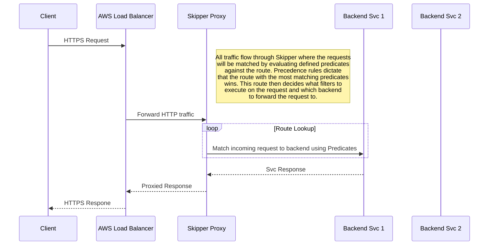

# Artifical Route Weighting
One important concept to understand about the Gateway is that it is merely a control plane for Skipper Ingress.  When you create a gateway K8s resource, the operator creates many Skipper Ingress resources on your behalf with specific [Predicate](https://opensource.zalando.com/skipper/reference/predicates/) and [Filter](https://opensource.zalando.com/skipper/reference/filters/) combinations to match the traffic as you decribe in your gateway yaml. In Skipper terms, predicates are used to match an incoming request and filters are used to apply transformations on a request and potentially return a static result instead of forwarding to the defined backend. Below is an example request flow for your application:



## Route Precedence
For an incoming request to match a route in Skipper, all the predicates need to evaluate to true. If multiple routes all evaluated to true then the route with the highest precedence is the route which is selected. If two or more routes have the same precedence then it is non-deterministic as to which route will be selected. Skipper automatically adds a Host predicate to each route that we define in the Gateway already, which helps limit the number of incoming requests that could be matched. From there, route precendence is calculated by the number of predicates which match.         

An example of the precedence rules for the routes that may exist for a sample gateway. In this example a request is coming from an employee token which is defined as an admin of the service:    
Example request:
```bash
  curl -X POST -d @payload.json -H "Content-Type: application/json" -H "Authorization: Bearer $(ztoken) https://ingress.url/restricted"
```

| Name  | Predicates | Score | Matched | Selected | Notes |
|-------|------------|-------|---------|----------|-------|
| Default Route Not Found | [PathSubTree](https://opensource.zalando.com/skipper/reference/predicates/#pathsubtree)          |  1     |  Y       | N  |  This is used as an informational fallback to show the client that no routes owned by the gateway have matched the incoming request. Although the predicates match, this route isn't chosen because it has a low precedence score    |
| Reject HTTP Traffic | [PathSubTree](https://opensource.zalando.com/skipper/reference/predicates/#pathsubtree) && [Header](https://opensource.zalando.com/skipper/reference/predicates/#header)           |  2     | X       | N | Checks the forwarded protocol header from AWS LB and rejects the request if it was http      |
| Admin | [Path](https://opensource.zalando.com/skipper/reference/predicates/#path) && [Method](https://opensource.zalando.com/skipper/reference/predicates/#method) && [JWTPayloadAnyKV](https://opensource.zalando.com/skipper/reference/predicates/#jwtpayloadanykv) && [Header](https://opensource.zalando.com/skipper/reference/predicates/#header) | 4 | Y | Y | This is the route which the HTTP request matches as it has the highest number of successfully evaluated predicates |
| Non-Whitelisted Reject Route | [Path](https://opensource.zalando.com/skipper/reference/predicates/#path) && [Method](https://opensource.zalando.com/skipper/reference/predicates/#method) && [Header](https://opensource.zalando.com/skipper/reference/predicates/#header)  | 3 | Y | N | This is used as an informational fallback for clients who are not whitelisted. Although the predicates match, this route isn't chosen because it has a lower precedence score |
| Service Specific Rate Limit Route | [Path](https://opensource.zalando.com/skipper/reference/predicates/#path) && [Method](https://opensource.zalando.com/skipper/reference/predicates/#method) && [JWTPayloadAnyKV](https://opensource.zalando.com/skipper/reference/predicates/#jwtpayloadanykv) && [Header](https://opensource.zalando.com/skipper/reference/predicates/#header) | 4 | N | N | This route is not matched because the Token Introspection is specifically looking for a service name |
| User Specific Rate Limit Route | [Path](https://opensource.zalando.com/skipper/reference/predicates/#path) && [Method](https://opensource.zalando.com/skipper/reference/predicates/#method) && [JWTPayloadAnyKV](https://opensource.zalando.com/skipper/reference/predicates/#jwtpayloadanykv) && [Header](https://opensource.zalando.com/skipper/reference/predicates/#header) | 4 | N | N | This route is not matched because the Token Introspection is specifically looking for a user name |

Below is a sample gateway resource which the above routes were generated from
```yaml
    apiVersion: zalando.org/v1
    kind: FabricGateway
    metadata:
      name: example
    spec:
      x-external-service-provider:
        stackSetName: some_stackset
        hosts:
          - ingress.url
      x-fabric-admins:
        - bmooney
      x-fabric-whitelist:
        - stups_service_name
      paths:
        /restricted:
          post:
            x-fabric-privileges:
              - some.write.scope
            x-fabric-employee-access:
              user-list:
                - jbloggs
            x-fabric-ratelimits:
              default-rate: 10
              period: minute
              target:
                stups_service_name: 50
```

### Manual Weighting
There was an issue discovered with how Skipper does traffic switching when running in tandem with Stacksets. Skipper will automatically add a Traffic predicate to one of the backend routes which can change the route precedence. So in the example we saw, admin requests where sometimes matched against service routes and service specific rate limits where degraded to the global rate limit. This is why we now add a specific [Weight](https://opensource.zalando.com/skipper/reference/predicates/#weight-priority) predicate to each of the routes to ensure that there is more than a precedence gap of 1 to avoid non-deterministic matching whn Skipper is adding these Traffic predicates.